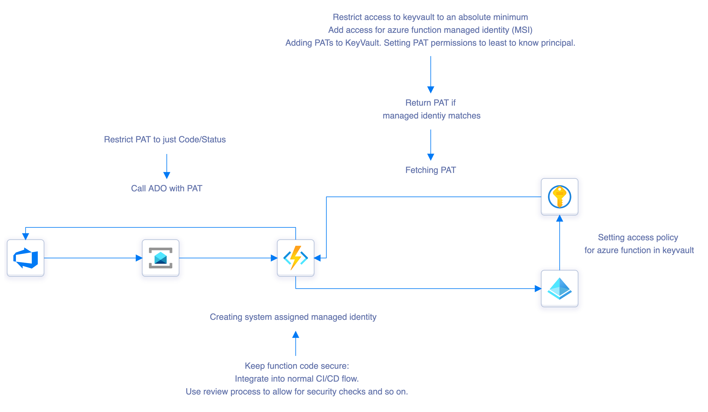

# Azure DevOps Pull Request verfification with Azure Function
You can find steps on how to setup the infrastructure and applications in the following description.

## Architecture

## Setup steps

### One click environment setup
You can use the button below to setup an environment in azure directly from here. 

### Setup with Azure DevOps
